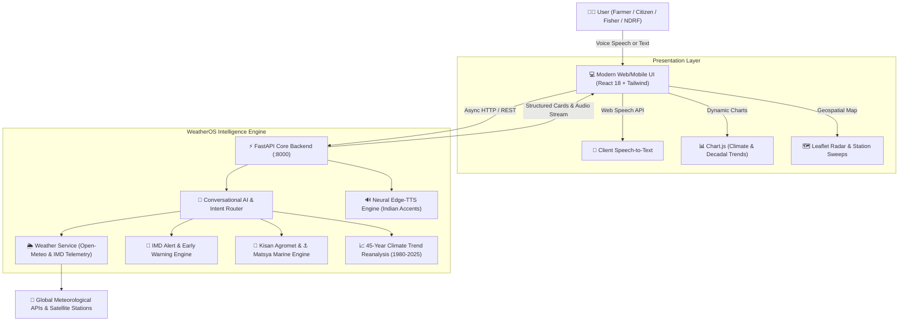

# 🌤️ WeatherOS (MausamAI / मौसम एआई)
### Intelligent Conversational AI Platform for Weather Forecasting, Early Warnings, and Climate Decision Support

> **Problem Statement 1 Solution**: Conversational AI for Weather Forecasting, Alerts, and Climate Information.
> 
> WeatherOS is a unified, multilingual, voice-first intelligent operating platform designed to overcome the fragmentation of weather bulletins, satellite feeds, and forecasting portals. It democratizes access to real-time forecasts, IMD extreme alerts, agromet decision systems, marine coastal safety, and historical climate trend analytics for rural farmers, coastal fishermen, disaster managers (NDRF/SDMA), and common citizens.

---

## 🌟 Key Capabilities & Architectural Pillars

| Capability | Implementation in WeatherOS | Impact & Beneficiary |
| :--- | :--- | :--- |
| **🎙️ Multilingual Conversational AI & Voice** | Natural language NLU intent classification supporting **10 regional & national languages** (Odia, Bengali, Tamil, Telugu, Marathi, Gujarati, Kannada, Punjabi, Malayalam, and English) with neural voice synthesis (`edge-tts`). | Rural accessibility for farmers & fishermen without literacy or language barriers. |
| **🚨 IMD Extreme-Weather Early Warnings** | Real-time 4-stage color-coded alerts (**Red, Orange, Yellow, Green**) for Heatwaves, Flash Floods, Heavy Rain, Severe Thunderstorms, and Squally Winds with regional subdivision feeds. | Preemptive disaster preparedness, reduced casualty rates, and automated civil defense checklists. |
| **🌾 Kisan Agromet Decision Support** | Micro-climate rules for **Pesticide Spray Feasibility** (wind drift & rain washout thresholds), **Irrigation Planning** (precipitation forecast vs soil moisture), and **Fungal Blight Risk**. | Farmers prevent pesticide wastage, optimize canal/borewell irrigation, and protect standing crops. |
| **⚓ Matsya Mitra (Marine Safety)** | Douglas sea scale computation, significant wave height, swell period, wind speed in knots, and IMD port warning signals (LC-III, GD-VIII). | Fishermen safety at sea, prevention of capsizing incidents, and coast guard emergency integration (VHF 16). |
| **📈 45-Year Historical Climate Observatory** | ERA5 multi-decadal reanalysis (1980–2025) analyzing warming rates (+°C/decade), monsoon rainfall departure anomalies (% LPA), and extreme heat days frequency. | Climate researchers, urban planners, water resource authorities, and policy makers. |
| **🗺️ Interactive Doppler Radar & Map** | Leaflet-based geospatial map showing Doppler weather radar sweeps and station telemetry. | Visual spatial awareness of convective rain systems and storm tracks. |

---

## 🏛️ System Architecture



---

## 🚀 Quickstart Guide

### 1. Requirements
- Python 3.10+ (Tested and verified on Python 3.14)
- Internet connection (for real-time satellite data and neural voice synthesis)

### 2. Run the Platform
In the root directory, simply run:
```bash
python run.py
```
Or directly using Uvicorn:
```bash
uvicorn backend.main:app --host 0.0.0.0 --port 8000 --reload
```

### 3. Open in Browser
Visit:
```
http://localhost:8000
```
API Documentation & Interactive Swagger UI:
```
http://localhost:8000/docs
```

---

## 💬 Sample Conversational Interactions

| Intent | Sample Voice/Text Query | WeatherOS Intelligence Output |
| :--- | :--- | :--- |
| **Pesticide Spraying** | *"Can I spray pesticide on my wheat crop today in Karnal?"* / *"क्या मैं आज अपनी गेहूं की फसल पर कीटनाशक छिड़क सकता हूँ?"* | Checks wind speed (&lt;15 km/h) and rain probability (&lt;20%). Returns approved/unfavorable decision badge with scientific explanation. |
| **Marine & Fishermen** | *"Are sea conditions safe for fishermen off Vizag coast?"* / *"என்னால் இன்று கடலுக்குச் செல்ல முடியுமா?"* | Computes wave height, swell period, wind knots, Douglas sea state, and outputs IMD port cautionary signal. |
| **Extreme Weather Alerts** | *"Show active alerts in Odisha"* / *"क्या कोई चक्रवात या हीटवेव चेतावनी है?"* | Returns IMD color-coded Red/Orange alert, impact assessment, civil defense action items, and emergency contacts (NDRF 1078). |
| **Climate Trends** | *"Show 40-year climate warming trends in Delhi"* / *"पिछले 40 वर्षों में जलवायु में क्या बदलाव आया है?"* | Fetches 1980–2025 ERA5 reanalysis, shows +1.26°C warming rate, decadal heatwave frequency chart, and climate adaptation guidelines. |
| **Irrigation Planning** | *"Should I irrigate my fields in Patna today?"* | Evaluates next 24-48h rainfall forecast against soil moisture needs to prevent waterlogging or water wastage. |

---

## 📂 Repository Structure

```
WeatherOS/
├── backend/
│   ├── config.py                 # Application settings & 11 Indian language voice mappings
│   ├── main.py                   # FastAPI application, static mounts & REST endpoints
│   ├── weather_service.py        # Real-time weather, hourly, 10-day forecast, AQI & Marine APIs
│   ├── alerts_engine.py          # IMD color-coded warnings (Red/Orange/Yellow/Green)
│   ├── climate_service.py        # 45-year historical climate analytics & decadal anomalies
│   ├── decision_engine.py        # Domain support: Kisan (Agri), Matsya (Marine), NDRF, Aviation
│   ├── conversational_agent.py   # Multilingual NLU, entity resolution & structured card generator
│   └── voice_service.py          # Neural Edge-TTS speech synthesis with authentic Indian voices
├── frontend/
│   └── static/
│       ├── index.html            # HTML5 shell with Tailwind, React 18, Leaflet & Chart.js
│       ├── app.js                # React application with speech recognition & domain dashboards
│       └── style.css             # Glassmorphism, animations, alert pulses & map styles
├── run.py                        # One-click startup runner
├── requirements.txt              # Python dependencies
└── README.md                     # Comprehensive documentation
```

---

## 🛡️ License & Acknowledgements
Developed for Problem Statement 1: *Conversational AI for Weather Forecasting, Alerts, and Climate Information*. Powered by open meteorological data from Open-Meteo, IMD bulletins, Copernicus ERA5, and INCOIS.
